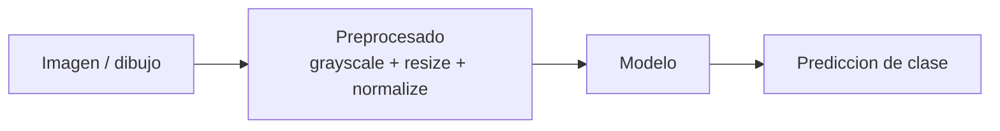
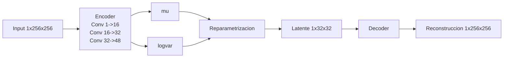
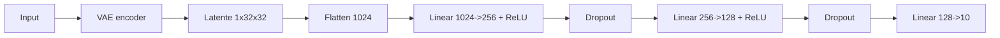
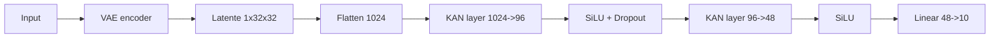
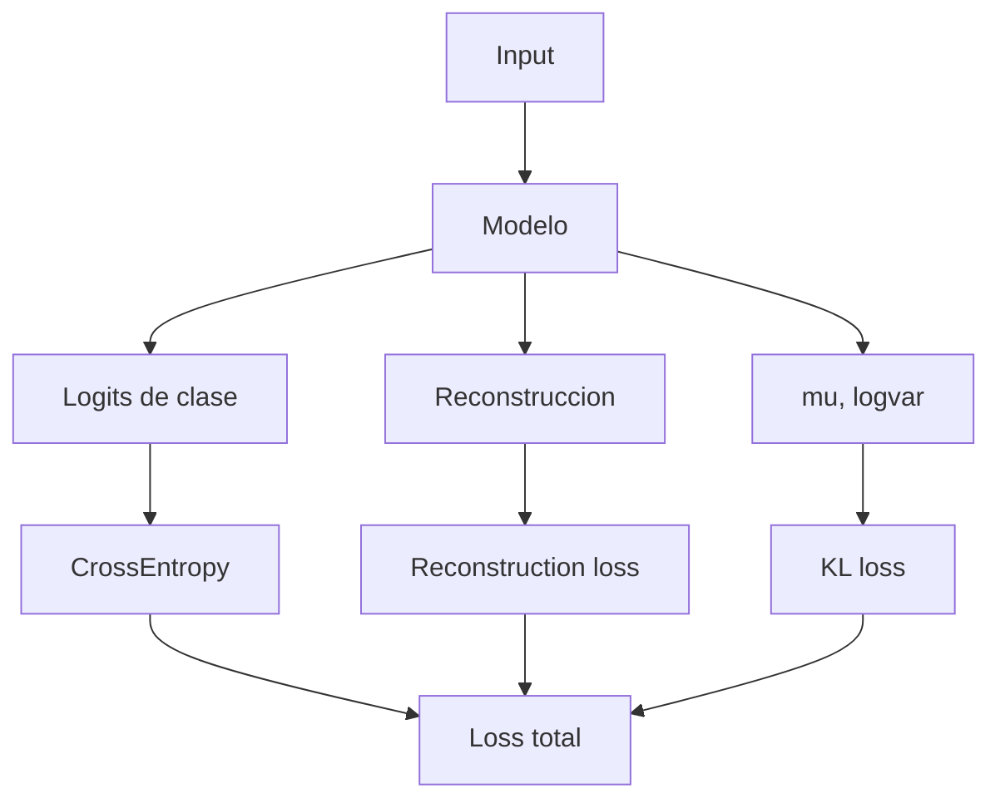

# Clasificacion De Artefactos Arqueologicos

Subtitulo: Comparacion entre CNN, VAE+MLP y VAE+KAN

Autor: Proyecto Arqueologia

---

# 1. Objetivo

- Comparar varias arquitecturas ligeras para clasificacion de artefactos arqueologicos.
- Mantener un coste computacional razonable.
- Usar el mismo dataset, las mismas etiquetas y el mismo pipeline general de entrenamiento.

Idea central:
La comparacion se hace entre un modelo visual directo (`CNN`) y dos modelos que primero comprimen la imagen a un espacio latente (`MLP` y `KAN` con `VAE`).

---

# 2. Pipeline General

- Entrada: imagen o dibujo del dataset.
- Preprocesado: grayscale, resize, normalizacion y augmentations simples en entrenamiento.
- Modelo: CNN o bien VAE + clasificador.
- Salida: etiqueta de clase.

Mensaje para exponer:
Todos los modelos resuelven la misma tarea final. Lo que cambia es como representan la informacion antes de clasificar.

---

# 3. Modelo CNN

- La CNN recibe la imagen directamente.
- Mantiene la estructura espacial durante casi todo el procesamiento.
- Usa convoluciones pequenas, batch normalization, activaciones ReLU y pooling.

```mermaid
flowchart LR
    A["Input 1x256x256"] --> B["Conv block 1<br/>1->16"]
    B --> C["MaxPool"]
    C --> D["Conv block 2<br/>16->32"]
    D --> E["MaxPool"]
    E --> F["Conv block 3<br/>32->64"]
    F --> G["MaxPool"]
    G --> H["Conv block 4<br/>64->96"]
    H --> I["AdaptiveAvgPool 1x1"]
    I --> J["Flatten"]
    J --> K["Linear 96->64 + ReLU"]
    K --> L["Linear 64->10"]
```

Estructura:
- 4 bloques convolucionales.
- Convoluciones `3x3`.
- `BatchNorm2d`.
- `ReLU`.
- `MaxPool2d`.
- Capa final totalmente conectada.

Mensaje para exponer:
La CNN es el baseline natural porque esta especializada para imagenes y aprende patrones espaciales locales.

---

# 4. VAE Para MLP Y KAN

- MLP y KAN no clasifican directamente la imagen original.
- Antes pasan por un `VAE` que aprende una representacion comprimida.
- Ese VAE genera un espacio latente de `32x32`.

Que hace el VAE:
- El encoder aprende una compresion de la imagen.
- El decoder obliga a que el latente conserve informacion suficiente para reconstruir.
- Ademas de clasificar, el sistema aprende una representacion mas estructurada.

Mensaje para exponer:
En lugar de dar la imagen cruda a la MLP o la KAN, primero aprendemos una version latente mas compacta y mas informativa.

---

# 5. Modelo VAE + MLP

- Primero se usa el VAE para obtener el latente `32x32`.
- Luego se aplana ese latente a un vector de `1024` valores.
- Finalmente se clasifica con una MLP.

Estructura:
- `VAE` inicial.
- `Flatten`.
- Capas `Linear`.
- `ReLU`.
- `Dropout`.
- Salida final con `num_classes`.

Mensaje para exponer:
La MLP convierte la clasificacion visual en un problema de clasificacion sobre un vector latente aprendido.

---

# 6. Modelo VAE + KAN

- Igual que la MLP, parte del latente `32x32` producido por el VAE.
- La diferencia esta en las capas internas.
- En vez de capas densas estandar, usa capas `RBFKANLayer`.

Que es una capa KAN aqui:
- Tiene una parte lineal estandar.
- Tiene una expansion no lineal basada en bases RBF.
- Combina ambas para modelar relaciones mas flexibles que una capa densa convencional.

Mensaje para exponer:
La KAN es una alternativa a la MLP, pero con una no linealidad mas estructurada que puede capturar relaciones complejas en el espacio latente.

---

# 7. Que Optimiza Cada Modelo

- `CNN`: solo clasificacion.
- `VAE + MLP` y `VAE + KAN`: clasificacion + reconstruccion + regularizacion KL.

Interpretacion:
- La perdida de clasificacion asegura que el modelo prediga bien la etiqueta.
- La reconstruccion obliga a conservar informacion visual en el latente.
- El termino KL regulariza el espacio latente para que sea mas estable.

---

# 8. Comparacion Conceptual

| Modelo | Entrada al clasificador | Tipo de conexiones | Idea principal |
|---|---|---|---|
| CNN | Imagen | Locales y compartidas | Aprender patrones espaciales |
| VAE + MLP | Latente 32x32 | Totalmente conectadas | Clasificar desde vector comprimido |
| VAE + KAN | Latente 32x32 | Lineal + bases RBF | Clasificacion con no linealidad estructurada |

Resumen:
- La `CNN` trabaja directamente con la geometria de la imagen.
- La `MLP` clasifica una representacion vectorial compacta.
- La `KAN` hace lo mismo que la MLP, pero con capas mas expresivas.

---

# 9. Que Se Guarda Y Como Se Evalua

- Checkpoints de cada modelo.
- Historial por epoca en JSON.
- GIFs comparativos de `loss` y `accuracy`.

Se guardan metricas como:
- `train_loss`
- `train_acc`
- `val_loss`
- `val_acc`

Y en los modelos con VAE tambien:
- `train_reconstruction_loss`
- `train_kl_loss`
- `val_reconstruction_loss`
- `val_kl_loss`

Mensaje para exponer:
No solo comparamos el resultado final, sino tambien la evolucion del aprendizaje durante el entrenamiento.

---

# 10. Conclusion

- Hemos construido un marco comparativo ligero y reutilizable.
- La `CNN` sirve como baseline visual directo.
- La `MLP` y la `KAN` ahora trabajan sobre un espacio latente aprendido por un `VAE`.
- Esto permite comparar tres filosofias distintas:
  - aprendizaje visual directo
  - clasificacion densa sobre latente
  - clasificacion con capas KAN sobre latente

Idea final para cerrar:
El trabajo no es solo entrenar tres redes, sino estudiar como cambia la representacion del problema cuando pasamos de imagen directa a espacio latente.

---

# 11. Preguntas

Posibles preguntas del tribunal o de clase:
- Por que usar un VAE antes de la MLP y la KAN.
- Si la comparacion entre arquitecturas es totalmente justa.
- Como afecta el numero de parametros a los resultados.
- Que ocurre si entrenamos con fotos frente a dibujos.
- Si el latente podria reutilizarse para retrieval o clustering.
